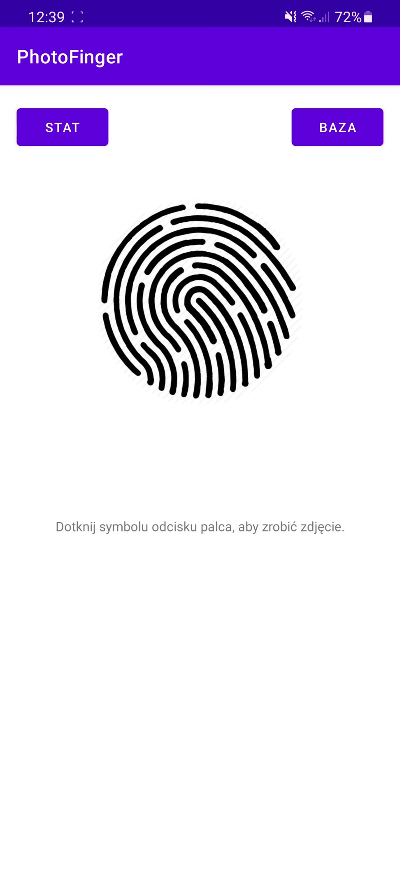
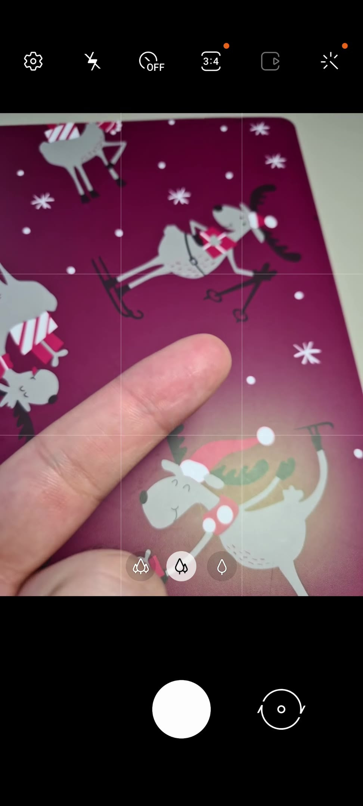
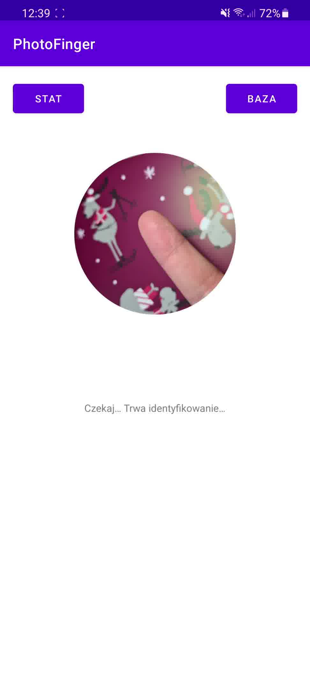
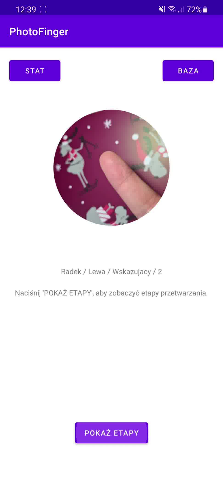
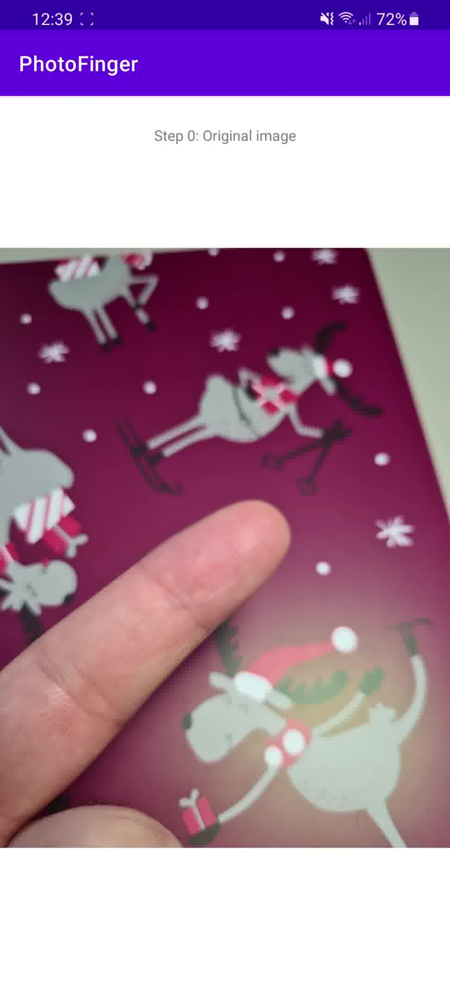
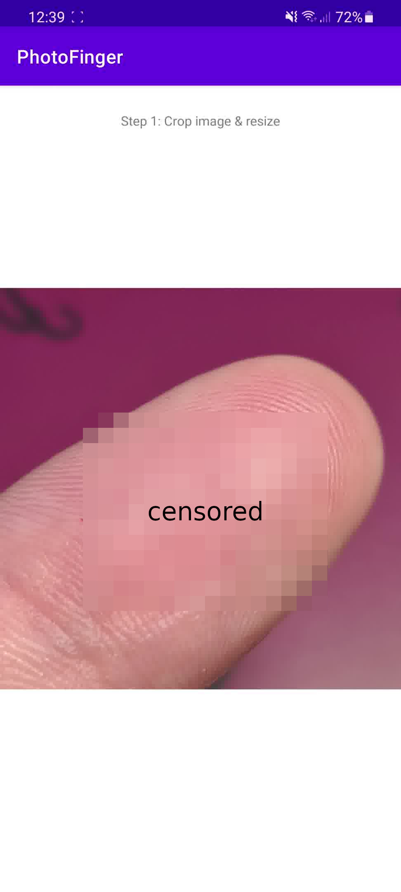
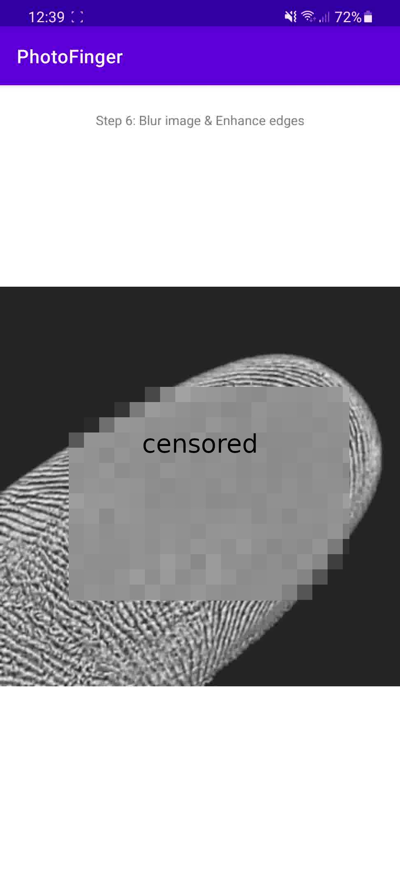
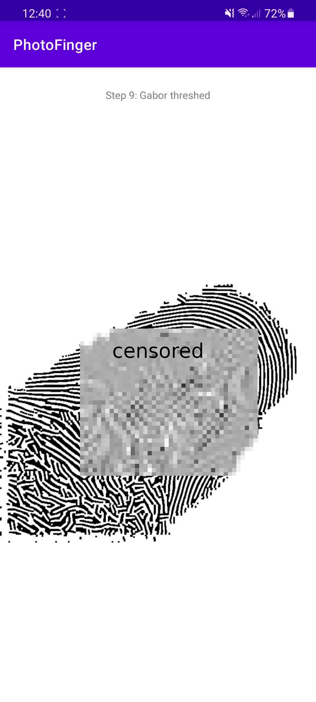
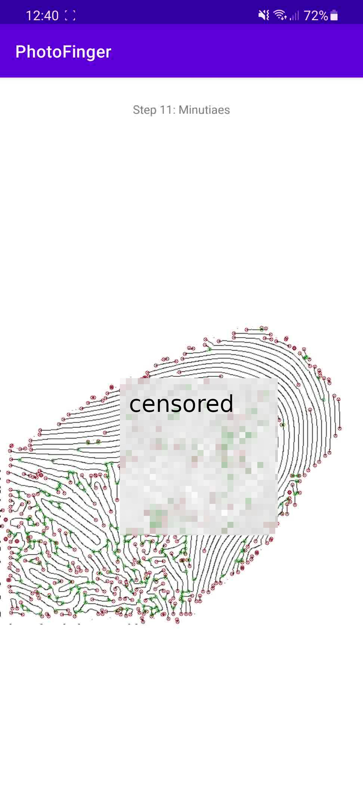

# PhotoFinger

Oprogramowanie realizujące rozpoznawanie odcisku palca na podstawie fotografii palca

Wymagane:
-----

* [Android Studio](https://developer.android.com/studio)
* [OpenCV](https://github.com/opencv/opencv)
* [SourceAFIS](https://github.com/robertvazan/sourceafis-java)

Działanie:
---

Koncepcja rozwiązania polega na wykonaniu zdjęcia za pomocą aparatu w smartfonie. Zdjęcie to poddawane jest działaniu szeregu algorytmów polepszających obraz oraz wyłuskujących z niego potrzebne cechy (wektor minucji). Następnie ten wektor porównywany jest z wektorami cech już istniejącymi w bazie danych. Na koniec następuje zwrócenie wyniku tego porównania – jeśli użytkownik został zidentyfikowany, to podawany jest również jego identyfikator w systemie.

| | | |
|:-------------------------:|:-------------------------:|:-------------------------:|
||||
||||
||||
